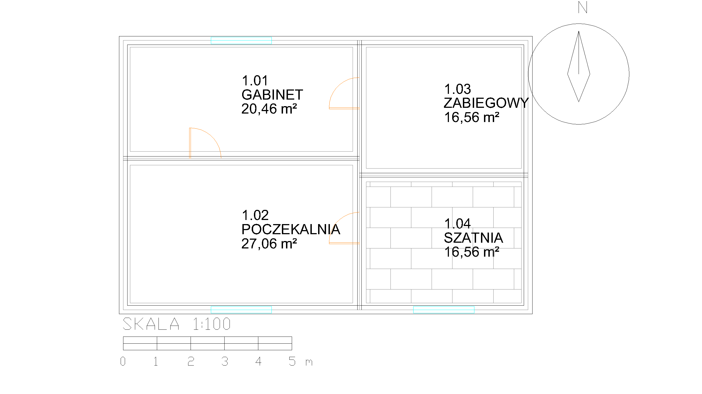

# Before anything else: please help an animal shelter in Wrocław 🐕

**This software is free. If it saves you time or money, please consider giving
that value to animals who have nothing.**

### 👉 [ratujemyzwierzaki.pl/schroniskowroclaw](https://www.ratujemyzwierzaki.pl/schroniskowroclaw)

**TOZ Schronisko dla Bezdomnych Zwierząt we Wrocławiu** - the *TOZ Shelter for
Homeless Animals in Wrocław* - has been rescuing animals **since 1962**. Situated
at 2 Ślazowa Street in Wrocław-Osobowice, run by **just over 30 employees**, some
of whom are also inspectors for the Polish Society for the Prevention of Cruelty
to Animals. They currently care for roughly **170 dogs and 140 cats**, plus
rabbits, parrots, snakes and eleven Vietnamese pigs.

> *"Together with the Volunteers who support us, we strive for one thing - to
> help those who cannot ask for it themselves."*

> **The donation page is in Polish only** - but it's possible to translate it using the internet browser. In Chrome,
> right-click anywhere on the page and choose **Translate to English** (Edge,
> Firefox and Safari all have the same feature). The payment method works in the same way,
> regardless of language.

> ### ⚠️ This is not our fundraiser.
>
> We are **not affiliated** with the shelter. We do **not** collect, handle or
> receive any of this money, and we get **nothing** if you donate. We are simply
> pointing at someone else's fundraiser because we think it deserves your
> attention more than we deserve your payment.
>
> Every złoty goes directly to the shelter through **ratujemyzwierzaki.pl**,
> a Polish donation platform. Verify it yourself before donating.

### Why we are asking now

**Winter is coming, and it's the hardest season that the shelter faces.** Cold weather
drives up every cost at once: heating itself can run into thousands of złoty per
month, animals need higher-calorie food just to keep their body temperature up,
and vets see a spike in frostbite and respiratory infections among the older
and sicker animals - the ones nobody adopts first. Winter is also a time when
shelters see an influx of animals given up as unwanted Christmas gifts.

These aren't abstract problems - they're real bills for heating, food, and vet care. 
That's what your donation goes toward.

You can give **10, 20, 50 or 100 zł once**, or **20–50 zł monthly**. You can also
"virtually adopt" a specific animal.

This system took real work: 692 tools, every one of them proven against live
AutoCAD by a check built to fail if the tool were wrong. It could have been sold.
Drafting automation is a market that pays, and an agent that produces
production-grade drawings without human interference :)

---
---

# ToolBank AutoCAD (v2025)

> A large-scale MCP (Model Context Protocol) ecosystem for AutoCAD: **692 tools across 51 specialized categories**, registered in ToolBank, sharing a single C# .NET backend (NETLOAD plugin + COM fallback + LISP), a Python vision/OCR sidecar, and a standards-validation engine (PL/EU/ISO norms).

**Goal:** an AI agent that produces production-grade AutoCAD drawings without human intervention.



<sub>Four rooms with computed areas, walls, doors, windows, a tiled floor, north arrow and
scale bar - 21 tool calls, no human drafting. Reproduce it with
[`scripts/demo-scene.py`](scripts/demo-scene.py); it runs against your AutoCAD and writes this
exact PNG. Building it found two defects that every previous run had reported as a success -
see [KNOWN-GAPS.md](docs/KNOWN-GAPS.md).</sub>

> **Not here for AutoCAD?** [**PATTERN.md**](PATTERN.md) is the transferable half - what we
> learned wrapping a thick desktop application in MCP, with the failures that produced each
> lesson. Nothing in it is AutoCAD-specific. Start there if you are building the same kind of
> thing over Excel, Revit, Photoshop or anything else with a real object model and a
> misleading command layer.


> **Picking this up fresh, or on another machine?** Start with [docs/HANDOVER.md](docs/HANDOVER.md) - environment, the working loop, what verification means here, and exactly what is left.

## Architecture in one sentence

Your AI client only ever sees `acad-router` (meta-tools) plus ToolBank. Everything else is one of ~30 specialized MCP micro-servers, loaded on demand via `mcpd_find` → `mcpd_connect`. All of them connect to a **single** .NET plugin injected into AutoCAD via NETLOAD.

```
AI Agent ── static ──> acad-router (10 meta-tools)
         ── static ──> toolbank-server + toolbank-gateway (ToolBank discovery/dynamic modes)
                            │ mcpd_find / mcpd_connect (lazy)
                            ▼
        ┌───────────────────┴────────────────────────┐
        │  acad-geometry-2d, -geometry-3d, -modify,   │
        │  -annotations, -blocks, -layers, -files,    │
        │  -architecture, -mechanical, -civil,        │
        │  -electrical, -vision, -validators, ...     │
        └───────────────────┬────────────────────────┘
                             ▼
              AcadMcp.Backend.exe --category <name>
                             │ Named Pipe
                             ▼
              AcadMcp.Plugin (in-process AutoCAD, via NETLOAD)
```

## Three ways to work with this

This repository is actually three separable things sharing one execution engine. Don't conflate them:

| | The Plugin | MCP servers | Companion |
|---|---|---|---|
| **What it is** | The execution engine: an AutoCAD extension NETLOAD'ed into AutoCAD, hosting a named-pipe server that makes real AutoCAD API calls | Standard stdio MCP servers (`AcadMcp.Backend.exe --category <name>`) that any MCP client can connect to | A self-contained, in-app chat panel (`ACADAI` command) with its own bundled AI provider integrations |
| **Talks to AutoCAD via** | Directly - it *is* the in-process extension | Named pipe → the Plugin | Named pipe → the Plugin (its own private instance) |
| **Talks to the AI via** | N/A | Your existing MCP client (Claude Desktop, Claude Code, or any other MCP-compatible client) - your subscription, your session | Its own built-in Anthropic/OpenAI/Gemini provider - bring your own API key (BYOK), entered once in its Settings tab |
| **Required?** | Yes, always - every other path depends on it | Optional - only if you want to drive AutoCAD from an external AI client | Optional - a fully separate, alternative front door; doesn't require a separate AI client at all |
| **Install guide** | [§1 below](#1-the-plugin--foundation-always-required) | [§2 below](#2-mcp-servers--for-your-own-ai-client) | [§3 below](#3-companion--standalone-in-app-assistant-byok) |

## Key components

| Component            | Role                                                                 |
| --------------------- | --------------------------------------------------------------------- |
| `AcadMcp.Backend`     | A single stdio MCP binary, parameterized by `--category`             |
| `AcadMcp.Plugin`      | AutoCAD extension (`IExtensionApplication`), named pipe server        |
| `AcadMcp.ComBridge`   | COM/ActiveX fallback for AutoCAD LT and recovery scenarios            |
| `AcadMcp.Lisp`        | LISP/SCR scripts and loader                                           |
| `AcadMcp.Shared`      | DTOs, pipe contracts, `ToolRequest`/`ToolResponse`                     |
| `AcadMcp.SourceGen`   | Roslyn source generator enforcing `[McpTool]` with an `Intent` field  |
| `AcadMcp.Vision`      | Python sidecar (FastAPI + gRPC, Claude Vision/GPT-4V, PaddleOCR)       |
| `toolbank-manifests/`  | JSON manifests for auto-registration in ToolBank                     |
| `bin-launchers/`      | Per-category `.cmd` launch scripts                                    |
| `docs/engineering-rules/`      | A growing rulebook enforcing architectural invariants                 |

## Verified

Before this was closed off as its own repository, the full system was built and smoke-tested end to end:

- **Build:** 0 errors, 0 warnings across the whole `.sln` (30 code categories / 31 manifests, consistency check clean).
- **Unit tests:** 139/139 passing.
- **Category sweep:** all 30 MCP category backends spawned over stdio and checked against their manifests - **30/30 exact tool-count matches.** (`router`'s manifest was missing `acad_call`, the tool actually used to dispatch category tool calls - a real drift between the manifest and the code, found during this pass and fixed by adding the missing entry, not by adjusting the count to match.)
- **Live AutoCAD integration, read path:** with AutoCAD 2025 actually running, `acad_status` confirmed a live named-pipe connection to the in-process plugin (real document, real layer data), `list_layers` returned the real layer table of the open drawing, and `list_entities_in_window` correctly validated required arguments and then returned real (empty) results for the active drawing.
- **Live AutoCAD integration, write path:** to avoid touching the real open drawing, a scratch document was created with `new_document`, a real line was drawn (`draw_line`, returned a real `AcDbLine` entity handle) and a real layer created (`create_layer`), both confirmed present via read-back (`list_entities_in_window`, `list_layers`), then the scratch document was closed without saving (`close_document`). `get_active_document` confirmed the original drawing was the active document before, during, and after - untouched throughout, `entityCount` unchanged.
- **Checkpoint / restore rollback:** `acad_restore_checkpoint` performs a real rollback via a `.dwg` snapshot reopen (not an AutoCAD UNDO command - see "Checkpoint/restore rollback" below for why). Verified live across all three cases: (1) same-document restore - drew a line after a checkpoint, restored, `list_documents`/`entityCount` confirmed the line was genuinely gone (`strategy=reopened_snapshot`); (2) no-snapshot checkpoint (`fileSnapshot:false`) - restore honestly reports `strategy=no_snapshot` and leaves the drawing untouched rather than pretending to roll back; (3) active document changed since the checkpoint - restore left the unrelated active document untouched and opened the snapshot as a separate document instead (`strategy=reopened_snapshot_as_new_document`), confirmed via `list_documents`.
- **Phase 7.1 livestream:** `acad_livestream.poll_events` captured real `command_will_start`/`command_ended` events fired by AutoCAD's own startup sequence before any test action ran, then a real `entity_appended` event for a `draw_line` call, with correct handle/dxfType/layer payload; `sinceSeq` correctly returned only new events on a second poll, not the whole backlog.
- **Domain build-out (architecture, mechanical, civil, electrical):** every new tool - wall-cutting `insert_door`/`insert_window`, mechanical `draw_hole_side_view` (all 4 kinds) and `draw_section_hatch`, civil `draw_alignment_spiral` and `draw_vertical_profile`, electrical `place_din_rail`/`place_panel_device_outline`/`route_wireway` - was exercised live on AutoCAD 2025 and returned real entity handles with the expected geometry (e.g. the spiral's derived end-bearing and clothoid parameter, the vertical profile's parabola-sampled vertex count). Two real, pre-existing bugs were found and fixed in the process - see [docs/PHASE-7-STATUS.md](docs/PHASE-7-STATUS.md) for detail - and one category (parametric constraint application) was found broken and pulled from the exposed tool set rather than shipped non-functional: see [Known Limitations](#known-limitations).

## Checkpoint/restore rollback

Earlier development builds of this repo shipped `acad_restore_checkpoint` as an explicit stub - it recorded a checkpoint but couldn't undo anything, and said so in its own response. Two straightforward implementations were tried first and both caused UI-thread deadlocks: `SendStringToExecute("_.UNDO _Mark ")` (queues a deferred command that leaves AutoCAD in "command active" state across the next pipe dispatch) and `Editor.Command("_.UNDO", "_Mark")` (same deadlock via a different path, surfacing after a couple of subsequent tool calls).

The mechanism actually shipped instead: `acad_undo_checkpoint` takes a full `.dwg` snapshot by default (`fileSnapshot:false` to opt out and record a boundary only). `acad_restore_checkpoint` then either closes the active document without saving and reopens the snapshot in its place (real rollback, when the active document still matches the one the checkpoint was taken on), opens the snapshot as an additional document without touching whatever else is active (when it doesn't match), or reports `no_snapshot` plainly (when there's nothing to restore from). `acad_design_iterate`'s own auto-rollback-on-abort step relies on this and now genuinely rolls back a failed plan instead of leaving its partial changes on the drawing.

## Quickstart

One command. It runs the whole chain - preflight, build, launchers, plugin bundle,
client config - and finishes with a live handshake against a running AutoCAD:

```powershell
powershell -ExecutionPolicy Bypass -File scripts\setup.ps1
```

`-Client cursor` (default), `claude-desktop` or `claude-code` picks which MCP client
gets configured. Add `-DryRun` to see every action first, `-SkipBuild` / `-SkipPlugin`
to skip stages. It is idempotent - safe to re-run - and backs up any config it edits.

Works on the Windows PowerShell 5.1 that ships with Windows; PowerShell 7 (`pwsh`) is
optional.

<details>
<summary>The same thing step by step, if you would rather drive it yourself</summary>

```powershell
# 1. Detect the installed AutoCAD
powershell -ExecutionPolicy Bypass -File scripts\detect-autocad.ps1

# 2. Build everything
dotnet build src/AcadMcp.sln -c Release

# 3. Generate a launcher for any category that is missing one
powershell -ExecutionPolicy Bypass -File scripts\package.ps1

# 4. Register every category with your local ToolBank instance
powershell -ExecutionPolicy Bypass -File scripts\register-mcps.ps1

# 5. Inject ONLY acad-router into your MCP client (ToolBank assumed already configured)
powershell -ExecutionPolicy Bypass -File scripts\install-cursor-config.ps1

# 6. Install the plugin into AutoCAD -- see "Installing into AutoCAD 2025" below
powershell -ExecutionPolicy Bypass -File scripts\install-plugin.ps1
```

</details>

## 1. The Plugin - foundation (always required)

This is the part that actually gets the plugin running inside AutoCAD. Every other path in this repository depends on it. The steps below are the ones verified live on AutoCAD 2025 (see [Verified](#verified)) - not just what the scripts claim to do.

### Prerequisites

- AutoCAD 2025 installed (`SeriesMin="R25"` in the plugin manifest - this targets 2025 and later; run `pwsh scripts/detect-autocad.ps1` to confirm your install is detected).
- .NET SDK 8.0 or later (`dotnet --version`).

### 1. Build the plugin

```powershell
dotnet build src/AcadMcp.sln -c Release
```

This produces `src/AcadMcp.Plugin/bin/Release/net8.0-windows/AcadMcp.Plugin.dll`.

### 2. Install as an auto-loading bundle (recommended)

```powershell
pwsh scripts/install-plugin.ps1
```

This copies the built plugin DLL (and its dependencies) into `%APPDATA%\Autodesk\ApplicationPlugins\AcadMcp.bundle\Contents\` and writes a `PackageContents.xml` with `LoadOnAutoCADStartup="True"`. AutoCAD reads this location on every launch - no manual `NETLOAD` needed from here on.

If a bundle is already installed, add `-Force` to overwrite it:

```powershell
pwsh scripts/install-plugin.ps1 -Force
```

Prefer to load it once per drawing instead of on every AutoCAD startup? Use `-Mode Acaddoc` instead - it patches `acaddoc.lsp` to `NETLOAD` the plugin whenever a drawing is opened.

### 3. Start (or restart) AutoCAD 2025

The bundle only takes effect on the next AutoCAD launch. If AutoCAD is already running, restart it once after installing.

### 4. Verify it's actually loaded

Inside AutoCAD, type at the command line:

```
ACADMCP_PING
```
Expected: `AcadMcp pong`.

```
ACADMCP_STATUS
```
Expected: pipe state, uptime, and the count of registered tools.

From outside AutoCAD, in a separate terminal, you can verify the same thing without touching the AutoCAD UI at all - this is exactly how the live checks in [Verified](#verified) were run:

```powershell
src\AcadMcp.Backend\bin\Release\net8.0\AcadMcp.Backend.exe --category router --ping-plugin
```

Or drive it through the actual MCP protocol (`acad_status` is one of `acad-router`'s meta-tools) - send `initialize` then `tools/call acad_status` over stdio to the same executable with `--category router`. A real response looks like:

```json
{"alive": true, "acadProductName": "AutoCAD", "acadVersion": "25.0.0.0", "documentName": "Drawing1.dwg", ...}
```

### Uninstalling

```powershell
pwsh scripts/install-plugin.ps1 -Uninstall
```

Removes the bundle directory and cleans up any `acaddoc.lsp` snippet it added.

## 2. MCP servers - for your own AI client

Use this path if you want to drive AutoCAD from an AI client you already use (Claude Desktop, Claude Code, or any other MCP-compatible client), through your own subscription/session. This requires [the Plugin](#1-the-plugin--foundation-always-required) to already be installed and AutoCAD running.

### 1. Build and package launchers

```powershell
dotnet build src/AcadMcp.sln -c Release
pwsh scripts/package.ps1
```

`package.ps1` generates one `.cmd` launcher per category under `bin-launchers/` (e.g. `acad-geometry-2d.cmd`), each wrapping `AcadMcp.Backend.exe --category <name>`.

### 2. Register every category with ToolBank

```powershell
pwsh scripts/register-mcps.ps1
```

This registers all 39 categories (see [`toolbank-manifests/`](../toolbank-manifests)) with your local ToolBank instance, so `mcpd_find` / `mcpd_connect` can discover and lazy-load them on demand instead of your client loading all 478 tools ([full reference](docs/TOOLS-REFERENCE.md)) up front.

The script auto-detects your registry path from `~/.cursor/mcp.json`, checking for a `toolbank-gateway` or `toolbank-server` entry (current ToolBank CLI names) and falling back to the older `toolbank-dynamic` / `toolbank-discovery` names for configs that haven't been migrated yet. If none of those are found, it falls back to `%USERPROFILE%\toolbank\registry\mcpd-registry.json`. Verified against both a `toolbank-gateway`-style config and a from-scratch run (registry file didn't exist yet): correct detection, correct registry creation, all 30 categories registered, and a second run correctly reports all 30 as unchanged instead of re-adding them. Override with `-Registry "<path>"` if needed; `-DryRun` previews without writing anything, even when the registry file doesn't exist yet.

### 3. Point your MCP client at `acad-router` only

```powershell
pwsh scripts/install-cursor-config.ps1
```

Your client only ever sees `acad-router`'s meta-tools (`acad_status`, `acad_find_tools`, `acad_load_category`, ...). Everything else loads lazily through ToolBank. This assumes ToolBank itself is already configured in your client - see the [ToolBank repository](https://github.com/KrzysztofAugiewicz/ToolBank) if it isn't.

### 4. Verify

Ask your AI client to call `acad_status`. With AutoCAD running and the Plugin loaded, you should get back real drawing data (see the [Verified](#verified) section above for an example response).

## 3. Companion - standalone in-app assistant (BYOK)

A completely separate product from the MCP-client path above: a self-contained chat panel that lives inside AutoCAD itself. No external AI client, no ToolBank configuration needed - you bring your own API key (BYOK) for Anthropic, OpenAI, or Gemini, entered once inside the panel.

It bundles its own copies of the Plugin and Backend, so it doesn't depend on the bundle installed in [§1](#1-the-plugin--foundation-always-required) - it runs independently, side by side with it if you have both installed.

### For local development / testing

```powershell
pwsh scripts/deploy-companion.ps1 -Configuration Release -Kill
```

`-Kill` terminates any running `acad.exe` first (the bundle's DLLs are locked while AutoCAD has them loaded). This builds `Companion.Host` + `Companion.Agent` + `Companion.Mcp`, along with the Plugin and Backend, and stages everything into `%APPDATA%\Autodesk\ApplicationPlugins\AcadMcpCompanion.bundle`.

### Building a distributable installer

```powershell
pwsh scripts/build-companion-installer.ps1
```

Stages a complete, self-contained bundle under `dist\AcadMcpCompanion.bundle` and compiles it into `dist\AcadMcpCompanion-Setup-<version>.exe` (via Inno Setup, if `ISCC.exe` is available) - or a `.zip` fallback that can be dropped straight into `%APPDATA%\Autodesk\ApplicationPlugins` by hand. The installer is per-user, needs no admin rights, and asks for nothing at install time: API keys are entered inside the panel on first run.

### Using it

1. Start (or restart) AutoCAD so both bundle modules load.
2. Type `ACADAI` at the AutoCAD command line to open the chat panel.
3. On first run, open Settings and enter your API key for your preferred provider (Anthropic, OpenAI, or Gemini) plus, optionally, which model to use per provider.
4. Chat normally - the assistant calls the same tool bank as the MCP-client path, through its own private connection to the Plugin.

Uninstall the same way as §1, targeting the Companion bundle:

```powershell
pwsh scripts/deploy-companion.ps1 -Uninstall
```

## Full tool reference

**478 tools across 39 categories**, generated directly from the manifests: [`docs/TOOLS-REFERENCE.md`](docs/TOOLS-REFERENCE.md). Every tool name and description there is pulled straight from [`toolbank-manifests/`](toolbank-manifests) by [`scripts/generate-tools-reference.py`](scripts/generate-tools-reference.py), so it can't drift out of sync the way hand-written tool lists do - run that script after adding or renaming a tool, or `--check` it in CI.

## Status

The system is built and live-verified end to end against real AutoCAD 2025: backend, plugin, all 31 categories, validators, the design iteration loop with real checkpoint rollback, the `acad-livestream` event channel, and the architecture/mechanical/civil/electrical/parametric domain build-out. Full verification log, including the reasoning behind non-obvious implementation choices: [docs/PHASE-7-STATUS.md](docs/PHASE-7-STATUS.md). Version details and change history: [CHANGELOG.md](CHANGELOG.md).

## Known Limitations

Called out here rather than left to be discovered by surprise:

- **`acad-parametric` covers layers, constraint inventory, and dynamic blocks - not constraint authoring.** `ensure_parametric_layers`, `list_constraint_entities`, `get_dynamic_block_properties`, and `set_dynamic_block_property` are implemented and live-verified. Applying new geometric or dimensional constraints via this category is not currently offered: every attempted implementation failed against real AutoCAD with `Autodesk.AutoCAD.Runtime.Exception: eInvalidInput` from `Editor.Command`, across four independent approaches, so those tools were removed rather than shipped in a broken state. See the header comment in `src/AcadMcp.Backend/Categories/Parametric/ParametricTools.cs` for the investigation detail, for whoever revisits this with live AutoCAD access.
- **DWG block libraries.** The architecture (`blocks/architectural/`) and mechanical (`blocks/mechanical/`) bundled block libraries (door/window/room-tag blocks, standard fastener/bearing blocks) are not built - the domain tools synthesize geometry inline instead of inserting library blocks. Building these means authoring and `WBLOCK`-ing real geometry for dozens of standard parts per discipline, a separate content-creation effort.

Per-discipline vision/YOLO detection is not part of this repository.

## Development / where to start

1. Open [docs/PHASE-7-STATUS.md](docs/PHASE-7-STATUS.md) - the verification log and source of truth for what's implemented.
2. The **always-apply** rule [`docs/engineering-rules/54-development-status.md`](docs/engineering-rules/54-development-status.md) keeps the agent from assuming a tool works just because it's in the manifest, and points to the Known Limitations above.

## Conventions

- **Code:** English. **Domain comments (CAD/standards):** Polish is fine.
- **MCP tool names:** `snake_case`, max 5 words, `<verb>_<entity>_<modifier?>` format.
- **Every tool MUST carry `[McpTool]` with an `Intent` field (5+ examples, PL and EN)** - enforced by the source generator.
- **Every category** has its own manifest at `toolbank-manifests/acad-<category>.json`.
- **Cross-category references are forbidden** - shared helpers live in `Categories/_Shared/`.

## Authors

- **Krzysztof Augiewicz** - Lead Architect & Creator - [LinkedIn](https://www.linkedin.com/in/krzysztof-a-97a170185/) · [GitHub](https://github.com/KrzysztofAugiewicz)
- **Kacper Pisarczyk** - Core Contributor - [LinkedIn](https://www.linkedin.com/in/kacper-pisarczyk-b165311aa/)
- **Sebastian Pawłowski** - Advisory & QA Support (testing, hardware/software provisioning) - [LinkedIn](https://www.linkedin.com/in/sebastianpawlowski/)

Full details in [AUTHORS.md](AUTHORS.md).

## License

[MIT](LICENSE) - use it, fork it, ship it, no strings attached.

Two caveats worth knowing before you build, both covered in full in
[THIRD-PARTY-NOTICES.md](THIRD-PARTY-NOTICES.md):

- **You need your own licensed AutoCAD 2025+.** The plugin compiles against Autodesk's
  managed assemblies by `HintPath` with `Private=false` / `ExcludeAssets=runtime` -
  nothing from Autodesk is redistributed here, and the MIT licence on this repository
  grants you no rights to Autodesk software.
- **The optional `[ml]` extra of the vision sidecar pulls in Ultralytics YOLO, which is
  AGPL-3.0.** A default install never imports it (`engines/yolo.py` resolves it lazily at
  call time), so the code as shipped links no AGPL. Installing that extra puts AGPL
  obligations on your deployment.
