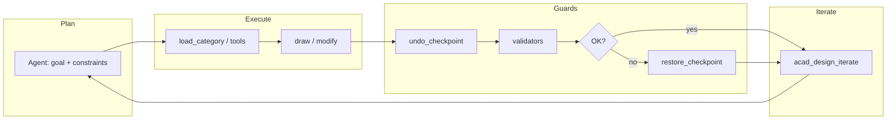

# Roadmap: Phases 7–8 (AutoCAD MCP Megasystem)

Single source of truth for the team and Cursor agents: **what's already shipped (Phases 0–6)** and **the active development track (Phases 7–8)**. Historical detail and tool lists: [CHANGELOG.md](../CHANGELOG.md).

---

## Status: Phases 0–6 (complete in the sense of this repo's roadmap)

No-spin summary — full detail in CHANGELOG:

| Area | Contents (summary) |
|--------|-------------------|
| **Backend / plugin** | One `AcadMcp.Backend` binary per `--category`, one .NET plugin, named-pipe bridge (rule `00-architecture-invariants.mdc`). |
| **MCP categories** | Geometry 2D/3D, modify, layers, blocks, annotations, files, vision scaffold, validators, workflow-ready manifests. |
| **Validators** | YAML rule engine + baseline standards; per-discipline rules (e.g. electrical, parametric). |
| **Domains (Phase 6)** | Architecture, mechanical, civil, electrical (schematic; panel deferred), parametric — see the Phase 6.x entries in CHANGELOG. |
| **Vision** | Sidecar, OCR/describe, pitfall rules in `32-acad-vision-traps.mdc`. |

**Note for agents:** do not treat this repository as an "empty Phase 0 bootstrap." Functional development continues from Phase 7 below.

---

## Phase 7 — in detail

### 7.0 Design loop (iterate + checkpoint + audit) — ✅ ROLLBACK IMPLEMENTED (verified live 2026-07-29)

- **`acad_undo_checkpoint` / `acad_restore_checkpoint`** — announced in the router manifest (`mcpbank-manifests/acad-router.json`) as Phase 7; a consistent plugin/backend implementation with atomic-rollback semantics on validation failure.
  - **Earlier state (as of the first live pass on 2026-07-29):** `acad_undo_checkpoint` correctly created a checkpoint (returned a real `id`/`label`/`stack_depth`). `acad_restore_checkpoint` did **not** roll back any changes yet — the response said so explicitly: `restore strategy=deferred undo_steps=0. Phase 7.0 MVP: automatic UNDO rewind is deferred; use Ctrl+Z in AutoCAD to roll back manually.` Verified empirically: a line drawn after the checkpoint was still present on the drawing after calling restore.
  - **Why the obvious fix wasn't a real AutoCAD UNDO command:** two straightforward implementations were tried and both caused UI-thread deadlocks. `SendStringToExecute("_.UNDO _Mark ")` queues a deferred command that only drains after returning from the `UiThreadDispatcher` callback, leaving AutoCAD in "command active" state; the next `doc.LockDocument()` from a subsequent tool call then wedges the UI thread. `Editor.Command("_.UNDO", "_Mark")` runs synchronously but still toggled the command-active flag across pipe dispatches in a way that deadlocked layer/geometry follow-up calls after roughly two tool calls.
  - **Fix shipped (2026-07-29):** rollback via a `.dwg` file snapshot instead of an AutoCAD UNDO command. `acad_undo_checkpoint` takes a full snapshot by default (`fileSnapshot:false` to opt out and record a boundary only). `acad_restore_checkpoint` now, depending on state: (a) same document as the checkpoint — closes it without saving and reopens the snapshot in its place (`strategy=reopened_snapshot`, a genuine rollback); (b) a different document is now active — leaves it untouched and opens the snapshot as an additional document instead (`strategy=reopened_snapshot_as_new_document`); (c) no snapshot exists (checkpoint was created with `fileSnapshot:false`) — reports `strategy=no_snapshot` plainly rather than silently doing nothing.
  - **Verified live (2026-07-29), all three cases:** (1) drew a line after a checkpoint on a scratch document, restored, `list_documents` confirmed `entityCount` back to 0 — the line was genuinely gone; (2) a `fileSnapshot:false` checkpoint restored as `no_snapshot`, entity count unchanged, no silent no-op dressed up as success; (3) switched the active document after a checkpoint, restored it — the other, unrelated active document was confirmed untouched via `list_documents`, and the snapshot came back as a separate document. Implementation: `src/AcadMcp.Plugin/Tools/CheckpointPluginTools.cs`.
- **`acad_design_iterate`** — the design-loop meta-tool (plan → execute → validate → rollback if needed); requires staying in sync with the router's tool list (see **7.4**, ✅ resolved). Its `fileSnapshot:false` override on checkpoint creation was removed on 2026-07-29 so its auto-rollback-on-abort step has an actual snapshot to restore from — before this fix, the loop's rollback path had nothing to work with even once the restore mechanism itself was fixed.
- **Step auditing** — logging agent decisions / tool call order for loop debugging and regression tracking.

### 7.1 Livestream / events — ✅ IMPLEMENTED (verified live 2026-07-29)

- **Scope decision:** `kind: "event"` + `AcadEvent` on the main pipe is real, live, and verified — entity-change (append/modify/erase) and command-lifecycle events are captured via genuine AutoCAD `Database`/`Document` hooks into a bounded ring buffer (2000 events, oldest dropped first). Exposed to the agent as **poll-based** (`acad-livestream.poll_events(sinceSeq)`), not a raw second named pipe: an MCP tool-calling agent has no channel to receive an unsolicited server push regardless of which pipe it travels over, so a poll API is what "livestream" actually means for this kind of client. Building a second literal named pipe would add transport complexity without changing what the agent can consume. See the header comment in `src/AcadMcp.Plugin/Tools/LivestreamPluginTools.cs` for the full reasoning.
- **`acad-livestream` category** — 3 tools: `poll_events` (returns events since a sequence number), `livestream_status` (buffer occupancy, drop count, hooked-document count), `clear_events`.
- **Verified live:** `poll_events` captured real `command_will_start`/`command_ended` events fired by AutoCAD's own startup sequence (before any test action ran), then a real `entity_appended` event for a `draw_line` call with correct handle/dxfType/layer; a follow-up poll with `sinceSeq` set to the prior `nextSeq` returned only the new events, not the whole backlog.

### 7.2 Validators — primitives (from the backlog) — ✅ ALREADY DONE (roadmap was stale, corrected 2026-07-29)

All 4 primitives already existed in `src/AcadMcp.Backend/Validators/CheckEvaluator.cs`, shipped as part of the original squashed initial commit, with real regression tests (`tests/AcadMcp.Tests/Validators/ValidatorsCoreTests.cs`, header comment literally says "Phase 7.2 regression") and real YAML rules already using them (`validators/electrical/wire-crossing-needs-junction.yaml`, `validators/electrical/tag-format-iec-81346.yaml`, `validators/civil/parcel-closure-within-tolerance.yaml`, `validators/mechanical/thread-is-arc-not-circle.yaml`):

- `entity_class_equals` ✅
- `text_matches_regex` ✅
- `polyline_closure_within` ✅
- `polyline_endpoints_share` ✅ (fixed a real bug in it, see 7.3 electrical below)

This roadmap previously listed these as missing backlog — that was simply stale documentation, discovered and corrected while auditing 7.3 (see the same pattern as 7.4's drift, just doc-vs-code instead of manifest-vs-code).

### 7.3 Domains — "Phase 7" backlog from manifests / rules — mostly done, 2 items genuinely open (2026-07-29)

Every domain in this section was audited against the actual code (not assumed from the roadmap's own prior claims, which turned out to be partially wrong the same way 7.2 was) before doing any work. Two real, unrelated bugs were found and fixed along the way, plus one new defect was found and is documented, not fixed.

- **Architecture — wall openings** ✅ FIXED. `insert_door`/`insert_window` never actually cut the host wall (a real bug, `.cursor/rules/36-architecture-domain-traps.mdc` §3 explicitly required it) — both now accept an optional `wallHandle` and cut the wall at their own jambs/axis span via `split_wall_at_opening` before drawing, verified live (real split wall segments with the correct gap length).
- **Mechanical — side views + blocks**: side views ✅ FIXED (`draw_hole_side_view`: through/blind/counterbore/countersink, `draw_section_hatch` using the existing material→pattern table) — verified live, all 4 kinds. Bundled block library ❌ still not started (see "DWG libraries" below).
- **Civil — profiles, spirals** ✅ FIXED. `draw_alignment_spiral` (2-term truncated clothoid power series, drafting-grade) and `draw_vertical_profile` (PVI list with optional parabolic vertical curves) — both verified live with plausible geometry (spiral end-bearing/clothoid parameter, profile vertex count matching the sampled parabola).
- **Electrical — panel, junction/style validators**: panel tools ✅ FIXED (`place_din_rail`, `place_panel_device_outline`, `route_wireway`) — verified live. Junction validator ✅ FIXED a real, separate bug: `draw_wire_junction` has always drawn a plain `Circle`, never a `JUNCTION` `BlockReference`, but `wire-crossing-needs-junction.yaml` matched on `block_name: JUNCTION` — the rule could never fire, on any drawing, regardless of whether junctions were missing. A second bug was found fixing the first: `ValidationEngine` only collects one entity snapshot per rule's own `scope.entity_types`, reused both as "what to check" and as the cross-entity candidate pool — scoping to `[Polyline, Line]` meant the junction `Circle` was never even fetched. Fixed both (match on `dxf_type: Circle` + `layer: E-WIRE`; added `Circle` to `entity_types`) and verified live: 0/2 → 1/2 → 0 violations as dots were added one at a time.
- **Parametric — DIMCONSTRAINT, DOF, 5 more geometric constraint types**: code for all of it shipped (Tangent/Concentric/Collinear/Equal/Symmetric geometric constraints, Linear/Aligned dimensional constraints) — but live-testing found that **every** constraint-application tool, including the 6 that predate this pass, fails against real AutoCAD 2025 with `eInvalidInput` from `Editor.Command`. Three independent fix attempts (ObjectId selection, point-on-entity selection, command-prefix order swap) all reproduce the identical failure. This is a genuine, newly-discovered, NOT-yet-fixed defect — see the "Known defect" section in the main README and the header comment in `src/AcadMcp.Backend/Categories/Parametric/ParametricTools.cs`. DOF reporting and BEDIT-scoped constraints remain unimplemented (see that same header comment for why: AutoCAD's .NET API doesn't expose the solver's DOF count directly, and BEDIT entry/exit hasn't been verified deadlock-safe).
- **DWG libraries** ❌ still not started. Architecture (`blocks/architectural/*.dwg`: DOOR_SINGLE_900, ROOM_TAG, etc.) and mechanical (`blocks/mechanical/*.dwg`: BOLT_HEX_M6-M24, WASHER_FLAT_M*, BEARING_RADIAL_*, etc.) block libraries require actually authoring and `WBLOCK`-ing real geometry for dozens of standard parts per discipline — a genuinely large, separate content-creation task, not a quick addition. Rushing a low-effort placeholder library would be exactly the kind of "looks done, isn't" result this project explicitly avoids elsewhere; it's called out here as open rather than faked.

### 7.4 Router / invariants — documentation/code sync — ✅ RESOLVED (2026-07-29)

**The problem:** three sources of truth had drifted apart. `RouterServer.cs` registers 10 tool stubs (including `acad_call`, the universal dispatcher). `mcpbank-manifests/acad-router.json`'s `tools_summary` only described 9 — `acad_call` was missing. `.cursor/rules/00-architecture-invariants.mdc` §6 said "~8 meta-tools" and listed 9 names (also without `acad_call`).

**Verified live:** a full 30/30-category sweep through the real `AcadMcp.Backend.exe --category router` (`tools/list`) returned exactly 10 tools, matching the code.

**Fixed:** added the missing `acad_call` entry to the manifest (description/tags matching the code, `tool_count_target` updated to 10), corrected `00-architecture-invariants.mdc` §6 to the correct count and the full list of 10 tools. All three sources (code, manifest, rule) now agree.

---

## Phase 8 — in detail

### Vision / YOLO

- **Per-discipline YOLO** — per `32-acad-vision-traps.mdc` (separate weights: arch/mech/elec/P&ID etc.).
- **Dataset + weight versioning** — `models/` directory, [scripts/setup-vision-models.ps1](../scripts/setup-vision-models.ps1) as the install path / 503 hint.
- **Regression tests** — vision must not break the existing OCR/describe paths.
- **Pixel ↔ drawing-unit calibration** — avoiding scale errors in detection (rule 32).

**Constraint:** `52-no-yolo-changes.mdc` applies to **completed** phases — new Phase 8 models and endpoints are **new** work, not a retroactive rewrite of Phases 0–6.

### Agent UX / documentation / operations

- **Prompt library** — task templates per discipline / scenario.
- **Auto-documentation** — tools, Cursor rules, manifests (consistent with MCP Nexus).
- **Operational runbook** — sidecar start/stop, plugin, common failures, limits.

### E2E, telemetry, cache

- **E2E with AutoCAD** — scenarios from NETLOAD to a tool call in a chosen category.
- **Loop telemetry (local only)** — iterate / checkpoint / validation (no sensitive data leaves the machine, per project policy).
- **Vision cache policy** — TTL, invalidation, keys per model and per document.

---

## Diagram (optional): design loop

---

## Where to start (Cursor)

1. Read this file before starting any development task.
2. Follow the **always-apply** rule `54-phase-7-8-current-work.mdc` (in `.cursor/rules/`).
3. Do not assume "the project is finished" — Phases 7–8 are explicitly in active planning/implementation.
