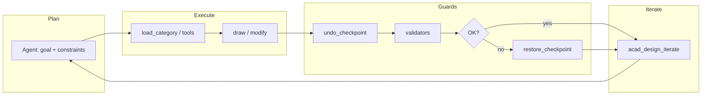

# Roadmap: Phases 7–8 (AutoCAD MCP Megasystem)

Single source of truth for the team and Cursor agents: **what's already shipped (Phases 0–6)** and **the active development track (Phases 7–8)**. Historical detail and tool lists: [CHANGELOG.md](../CHANGELOG.md).

---

## Status: Phases 0–6 (complete in the sense of this repo's roadmap)

No-spin summary — full detail in CHANGELOG:

| Area | Contents (summary) |
|--------|-------------------|
| **Backend / plugin** | One `AcadMcp.Backend` binary per `--category`, one .NET plugin, named-pipe bridge (rule `00-architecture-invariants.mdc`). |
| **MCP categories** | Geometry 2D/3D, modify, layers, blocks, annotations, files, vision scaffold, validators, workflow-ready manifests. |
| **Validators** | YAML rule engine + baseline standards; per-discipline rules (e.g. electrical, parametric). |
| **Domains (Phase 6)** | Architecture, mechanical, civil, electrical (schematic; panel deferred), parametric — see the Phase 6.x entries in CHANGELOG. |
| **Vision** | Sidecar, OCR/describe, pitfall rules in `32-acad-vision-traps.mdc`. |

**Note for agents:** do not treat this repository as an "empty Phase 0 bootstrap." Functional development continues from Phase 7 below.

---

## Phase 7 — in detail

### 7.0 Design loop (iterate + checkpoint + audit) — ✅ ROLLBACK IMPLEMENTED (verified live 2026-07-29)

- **`acad_undo_checkpoint` / `acad_restore_checkpoint`** — announced in the router manifest (`mcpbank-manifests/acad-router.json`) as Phase 7; a consistent plugin/backend implementation with atomic-rollback semantics on validation failure.
  - **Earlier state (as of the first live pass on 2026-07-29):** `acad_undo_checkpoint` correctly created a checkpoint (returned a real `id`/`label`/`stack_depth`). `acad_restore_checkpoint` did **not** roll back any changes yet — the response said so explicitly: `restore strategy=deferred undo_steps=0. Phase 7.0 MVP: automatic UNDO rewind is deferred; use Ctrl+Z in AutoCAD to roll back manually.` Verified empirically: a line drawn after the checkpoint was still present on the drawing after calling restore.
  - **Why the obvious fix wasn't a real AutoCAD UNDO command:** two straightforward implementations were tried and both caused UI-thread deadlocks. `SendStringToExecute("_.UNDO _Mark ")` queues a deferred command that only drains after returning from the `UiThreadDispatcher` callback, leaving AutoCAD in "command active" state; the next `doc.LockDocument()` from a subsequent tool call then wedges the UI thread. `Editor.Command("_.UNDO", "_Mark")` runs synchronously but still toggled the command-active flag across pipe dispatches in a way that deadlocked layer/geometry follow-up calls after roughly two tool calls.
  - **Fix shipped (2026-07-29):** rollback via a `.dwg` file snapshot instead of an AutoCAD UNDO command. `acad_undo_checkpoint` takes a full snapshot by default (`fileSnapshot:false` to opt out and record a boundary only). `acad_restore_checkpoint` now, depending on state: (a) same document as the checkpoint — closes it without saving and reopens the snapshot in its place (`strategy=reopened_snapshot`, a genuine rollback); (b) a different document is now active — leaves it untouched and opens the snapshot as an additional document instead (`strategy=reopened_snapshot_as_new_document`); (c) no snapshot exists (checkpoint was created with `fileSnapshot:false`) — reports `strategy=no_snapshot` plainly rather than silently doing nothing.
  - **Verified live (2026-07-29), all three cases:** (1) drew a line after a checkpoint on a scratch document, restored, `list_documents` confirmed `entityCount` back to 0 — the line was genuinely gone; (2) a `fileSnapshot:false` checkpoint restored as `no_snapshot`, entity count unchanged, no silent no-op dressed up as success; (3) switched the active document after a checkpoint, restored it — the other, unrelated active document was confirmed untouched via `list_documents`, and the snapshot came back as a separate document. Implementation: `src/AcadMcp.Plugin/Tools/CheckpointPluginTools.cs`.
- **`acad_design_iterate`** — the design-loop meta-tool (plan → execute → validate → rollback if needed); requires staying in sync with the router's tool list (see **7.4**, ✅ resolved). Its `fileSnapshot:false` override on checkpoint creation was removed on 2026-07-29 so its auto-rollback-on-abort step has an actual snapshot to restore from — before this fix, the loop's rollback path had nothing to work with even once the restore mechanism itself was fixed.
- **Step auditing** — logging agent decisions / tool call order for loop debugging and regression tracking.

### 7.1 Livestream / events

- **Separate `livestream` channel** — per `17-pipe-protocol.mdc`: streaming does **not** belong on the main JSON pipe; a separate pipe in Phase 7.
- **`kind: "event"`** on the main protocol — `AcadEvent` for entity-change / command-lifecycle events (the plugin does not emit events before the handshake completes).
- **`acad-livestream` category** (or an equivalent manifest name) — tools/contract for subscribing to or consuming the stream, consistent with MCP Nexus.

### 7.2 Validators — primitives (from the backlog)

Extend the rule engine with the missing primitives referenced in CHANGELOG / domain rules:

- `entity_class_equals`
- `text_matches_regex`
- `polyline_closure_within`
- `polyline_endpoints_share`

Goal: unblock validators that are currently deliberately deferred (e.g. tag-prefix formatting, missing junction dots) without resorting purely to "at-write-time" enforcement in the tools.

### 7.3 Domains — "Phase 7" backlog from manifests / rules

- **DWG libraries** — blocks under `blocks/...` (e.g. electrical, mechanical, architecture) as shared assets with manifests.
- **Architecture** — wall openings (details tied to layers/blocks), among others.
- **Mechanical** — side views + blocks (extension of Phase 6).
- **Civil** — profiles, spirals (per the civil manifest scope).
- **Electrical** — panel, contact xrefs, junction/style validators (schematic ↔ layout).
- **Parametric** — DIMCONSTRAINT, BEDIT, degrees of freedom (DOF) wherever the AutoCAD API allows; consistency with `42-parametric-domain-traps.mdc`.

### 7.4 Router / invariants — documentation/code sync — ✅ RESOLVED (2026-07-29)

**The problem:** three sources of truth had drifted apart. `RouterServer.cs` registers 10 tool stubs (including `acad_call`, the universal dispatcher). `mcpbank-manifests/acad-router.json`'s `tools_summary` only described 9 — `acad_call` was missing. `.cursor/rules/00-architecture-invariants.mdc` §6 said "~8 meta-tools" and listed 9 names (also without `acad_call`).

**Verified live:** a full 30/30-category sweep through the real `AcadMcp.Backend.exe --category router` (`tools/list`) returned exactly 10 tools, matching the code.

**Fixed:** added the missing `acad_call` entry to the manifest (description/tags matching the code, `tool_count_target` updated to 10), corrected `00-architecture-invariants.mdc` §6 to the correct count and the full list of 10 tools. All three sources (code, manifest, rule) now agree.

---

## Phase 8 — in detail

### Vision / YOLO

- **Per-discipline YOLO** — per `32-acad-vision-traps.mdc` (separate weights: arch/mech/elec/P&ID etc.).
- **Dataset + weight versioning** — `models/` directory, [scripts/setup-vision-models.ps1](../scripts/setup-vision-models.ps1) as the install path / 503 hint.
- **Regression tests** — vision must not break the existing OCR/describe paths.
- **Pixel ↔ drawing-unit calibration** — avoiding scale errors in detection (rule 32).

**Constraint:** `52-no-yolo-changes.mdc` applies to **completed** phases — new Phase 8 models and endpoints are **new** work, not a retroactive rewrite of Phases 0–6.

### Agent UX / documentation / operations

- **Prompt library** — task templates per discipline / scenario.
- **Auto-documentation** — tools, Cursor rules, manifests (consistent with MCP Nexus).
- **Operational runbook** — sidecar start/stop, plugin, common failures, limits.

### E2E, telemetry, cache

- **E2E with AutoCAD** — scenarios from NETLOAD to a tool call in a chosen category.
- **Loop telemetry (local only)** — iterate / checkpoint / validation (no sensitive data leaves the machine, per project policy).
- **Vision cache policy** — TTL, invalidation, keys per model and per document.

---

## Diagram (optional): design loop

---

## Where to start (Cursor)

1. Read this file before starting any development task.
2. Follow the **always-apply** rule `54-phase-7-8-current-work.mdc` (in `.cursor/rules/`).
3. Do not assume "the project is finished" — Phases 7–8 are explicitly in active planning/implementation.
