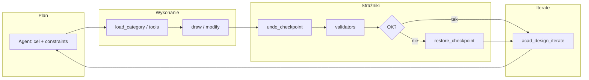

# Roadmap: Fazy 7–8 (AutoCAD MCP Megasystem)

Jedno źródło prawdy dla zespołu i agentów Cursor: **co jest już dostarczone (Fazy 0–6)** oraz **aktywna ścieżka rozwoju (Fazy 7–8)**. Szczegóły historyczne i listy narzędzi: [CHANGELOG.md](../CHANGELOG.md).

---

## Stan: Fazy 0–6 (ukończone w sensie roadmapy repozytorium)

Skrót bez „sprzedaży” — pełny opis w CHANGELOG:

| Obszar | Zawartość (skrót) |
|--------|-------------------|
| **Backend / plugin** | Jedna binarka `AcadMcp.Backend` per `--category`, jeden plugin .NET, most named pipe (reguła `00-architecture-invariants.mdc`). |
| **Kategorie MCP** | Geometry 2D/3D, modify, layers, blocks, annotations, pliki, vision scaffold, validators, workflow-ready manifesty. |
| **Walidatory** | Silnik YAML + standardy baseline; reguły per domena (m.in. electrical, parametric). |
| **Domeny (Faza 6)** | Architecture, mechanical, civil, electrical (schemat; panel odłożony), parametric — patrz wpisy Phase 6.x w CHANGELOG. |
| **Vision** | Sidecar, OCR/describe, reguły pułapek w `32-acad-vision-traps.mdc`. |

**Uwaga dla agentów:** nie traktować repozytorium jako „pustego bootstrapu Fazy 0”. Rozwój funkcjonalny kontynuuje się od Fazy 7 poniżej.

---

## Faza 7 — szczegółowo

### 7.0 Pętla projektowa (iterate + checkpoint + audyt) — ⚠️ ROLLBACK NIEZAIMPLEMENTOWANY (zweryfikowane na żywo 2026-07-29)

- **`acad_undo_checkpoint` / `acad_restore_checkpoint`** — zapowiedziane w manifeście routera (`mcpbank-manifests/acad-router.json`) jako Phase 7; spójna implementacja w pluginie/backendzie z semantyką cofania atomowego przy porażce walidacji.
  - **Stan faktyczny:** `acad_undo_checkpoint` poprawnie tworzy checkpoint (zwraca realne `id`/`label`/`stack_depth`). `acad_restore_checkpoint` **nie cofa jeszcze żadnych zmian** — odpowiedź wprost mówi `restore strategy=deferred undo_steps=0. Phase 7.0 MVP: automatic UNDO rewind is deferred; use Ctrl+Z in AutoCAD to roll back manually.` Zweryfikowane empirycznie: narysowana po checkpoincie linia pozostała na rysunku po wywołaniu restore. To pozostaje do zaimplementowania (prawdziwa integracja z transakcjami/UNDO-group AutoCAD-a), nie jest kosmetyczną poprawką.
- **`acad_design_iterate`** — meta-narzędzie pętli projektowej (plan → wykonanie → walidacja → ewentualny rollback); wymaga synchronizacji z listą narzędzi routera (patrz **7.4**, ✅ rozwiązane). **Uwaga:** dopóki `acad_restore_checkpoint` nie cofa zmian naprawdę, ścieżka auto-rollback w `acad_design_iterate` też nie działa end-to-end.
- **Audyt kroków** — logowanie decyzji agenta / kolejności wywołań narzędzi dla debugowania pętli i regresji.

### 7.1 Livestream / eventy

- **Osobny kanał `livestream`** — zgodnie z `17-pipe-protocol.mdc`: strumieniowanie **nie** należy do głównego pipe’a JSON; osobny pipe w Fazie 7.
- **`kind: "event"`** na głównym protokole — `AcadEvent` dla zdarzeń typu zmiana encji / cykl życia poleceń (plugin nie emituje eventów przed ukończeniem handshake).
- **Kategoria `acad-livestream`** (lub równoważna nazwa w manifestach) — narzędzia/kontrakt subskrypcji lub konsumpcji strumienia zgodnie z MCPBank.

### 7.2 Walidatory — prymitywy (z backlogu)

Rozszerzenie silnika reguł o brakujące prymitywy wspomniane w CHANGELOG / regułach domenowych:

- `entity_class_equals`
- `text_matches_regex`
- `polyline_closure_within`
- `polyline_endpoints_share`

Cel: odblokowanie walidatorów obecnie świadomie odłożonych (np. format prefiksów tagów, brakujące junction dots) bez obchodzenia się wyłącznie „at-write-time” w narzędziach.

### 7.3 Domeny — backlog „Phase 7” z manifestów / reguł

- **Biblioteki DWG** — bloki pod `blocks/...` (np. electrical, mechanical, architecture) jako współdzielone zasoby z manifestami.
- **Architektura** — m.in. otwory w ścianach (detale powiązane z warstwami/blokami).
- **Mechanika** — widoki boczne + bloki (rozszerzenie względem Fazy 6).
- **Civil** — profile, spirale (wg zakresu manifestów civil).
- **Electrical** — panel, xref styków, walidatory junction/style (schemat ↔ layout).
- **Parametryka** — DIMCONSTRAINT, BEDIT, stopnie swobody (DOF) tam, gdzie API AutoCAD na to pozwala; spójność z `42-parametric-domain-traps.mdc`.

### 7.4 Router / inwarianty — synchronizacja dokumentacji i kodu — ✅ ROZWIĄZANE (2026-07-29)

**Był problem:** trzy źródła prawdy się rozjeżdżały. `RouterServer.cs` rejestruje 10 tool-stubów (w tym `acad_call`, uniwersalny dispatcher). `mcpbank-manifests/acad-router.json`'s `tools_summary` opisywał tylko 9 — brakowało `acad_call`. `.cursor/rules/00-architecture-invariants.mdc` §6 mówił „~8 meta-tools” i wymieniał 9 nazw (też bez `acad_call`).

**Zweryfikowane na żywo:** pełny sweep 30/30 kategorii przez realny `AcadMcp.Backend.exe --category router` (`tools/list`) zwrócił dokładnie 10 narzędzi, zgodnych z kodem.

**Naprawione:** dodano brakujący wpis `acad_call` do manifestu (z opisem/tagami zgodnymi z kodem, `tool_count_target` zaktualizowany na 10), poprawiono `00-architecture-invariants.mdc` §6 na poprawną liczbę i pełną listę 10 narzędzi. Wszystkie trzy źródła (kod, manifest, reguła) teraz się zgadzają.

---

## Faza 8 — szczegółowo

### Vision / YOLO

- **YOLO per dyscyplina** — zgodnie z `32-acad-vision-traps.mdc` (osobne wagi: arch/mech/elec/P&ID itd.).
- **Dataset + wersjonowanie wag** — katalog `models/`, skrypt [scripts/setup-vision-models.ps1](../scripts/setup-vision-models.ps1) jako ścieżka instalacji / podpowiedzi 503.
- **Testy regresji** — wizja nie psuje istniejących ścieżek OCR/describe.
- **Kalibracja piksel ↔ jednostki rysunku** — unikanie błędów skali przy detekcji (reguła 32).

**Ograniczenie:** `52-no-yolo-changes.mdc` dotyczy **ukończonych** faz — nowe modele i endpointy Fazy 8 to **nowa** praca, nie retroaktywne „przepisywanie” Faz 0–6.

### Agent UX / dokumentacja / operacje

- **Biblioteka promptów** — szablony zadań per dyscyplina / scenariusz.
- **Auto-dokumentacja** — narzędzia, reguły Cursor, manifesty (spójne z MCPBank).
- **Runbook operacyjny** — start/stop sidecara, plugin, typowe awarie, limity.

### E2E, telemetria, cache

- **E2E z AutoCAD** — scenariusze od NETLOAD do narzędzia w wybranej kategorii.
- **Telemetria pętli (lokalnie)** — iterate / checkpoint / walidacja (bez wysyłki wrażliwych danych poza politykę projektu).
- **Polityka cache vision** — TTL, invalidacja, klucze per model i per dokument.

---

## Diagram (opcjonalny): pętla projektowa

---

## Od czego zacząć (Cursor)

1. Przeczytaj ten plik przy pierwszym zadaniu rozwojowym.
2. Trzymaj się reguły **always-apply** `54-phase-7-8-current-work.mdc` (katalog `.cursor/rules/`).
3. Nie zakładaj „projektu skończonego” — Fazy 7–8 są explicite w toku planowania/wdrożenia.
