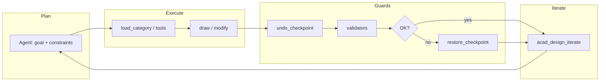

# Development History & Verification Status (ToolBank AutoCAD)

Single source of truth for the team and AI coding agents on what shipped, how it was verified, and what's explicitly out of scope for v1. Historical detail and tool lists: [CHANGELOG.md](../CHANGELOG.md). Current known gaps: see [README.md § Known Limitations](../README.md#known-limitations).

---

## Foundation

No-spin summary — full detail in CHANGELOG:

| Area | Contents (summary) |
|--------|-------------------|
| **Backend / plugin** | One `AcadMcp.Backend` binary per `--category`, one .NET plugin, named-pipe bridge (rule `00-architecture-invariants.md`). |
| **MCP categories** | Geometry 2D/3D, modify, layers, blocks, annotations, files, vision scaffold, validators, workflow-ready manifests. |
| **Validators** | YAML rule engine + baseline standards; per-discipline rules (e.g. electrical, parametric). |
| **Domains** | Architecture, mechanical, civil, electrical (schematic + panel layout), parametric — see CHANGELOG for the full build-out history. |
| **Vision** | Sidecar, OCR/describe, pitfall rules in `32-acad-vision-traps.md`. |

---

## Item-by-item verification log

### 7.0 Design loop (iterate + checkpoint + audit) — ✅ verified live 2026-07-29

- **`acad_undo_checkpoint` / `acad_restore_checkpoint`** — a consistent plugin/backend implementation with atomic-rollback semantics on validation failure.
  - **Earlier state:** `acad_undo_checkpoint` correctly created a checkpoint (returned a real `id`/`label`/`stack_depth`). `acad_restore_checkpoint` did **not** roll back any changes yet. Verified empirically: a line drawn after the checkpoint was still present on the drawing after calling restore.
  - **Why the obvious fix wasn't a real AutoCAD UNDO command:** two straightforward implementations were tried and both caused UI-thread deadlocks. `SendStringToExecute("_.UNDO _Mark ")` queues a deferred command that only drains after returning from the `UiThreadDispatcher` callback, leaving AutoCAD in "command active" state; the next `doc.LockDocument()` from a subsequent tool call then wedges the UI thread. `Editor.Command("_.UNDO", "_Mark")` runs synchronously but still toggled the command-active flag across pipe dispatches in a way that deadlocked layer/geometry follow-up calls after roughly two tool calls.
  - **Fix shipped:** rollback via a `.dwg` file snapshot instead of an AutoCAD UNDO command. `acad_undo_checkpoint` takes a full snapshot by default (`fileSnapshot:false` to opt out and record a boundary only). `acad_restore_checkpoint` now, depending on state: (a) same document as the checkpoint — closes it without saving and reopens the snapshot in its place (`strategy=reopened_snapshot`, a genuine rollback); (b) a different document is now active — leaves it untouched and opens the snapshot as an additional document instead (`strategy=reopened_snapshot_as_new_document`); (c) no snapshot exists — reports `strategy=no_snapshot` plainly rather than silently doing nothing.
  - **Verified live, all three cases:** (1) drew a line after a checkpoint on a scratch document, restored, `list_documents` confirmed `entityCount` back to 0; (2) a `fileSnapshot:false` checkpoint restored as `no_snapshot`, entity count unchanged; (3) switched the active document after a checkpoint, restored it — the other, unrelated active document was confirmed untouched, and the snapshot came back as a separate document. Implementation: `src/AcadMcp.Plugin/Tools/CheckpointPluginTools.cs`.
- **`acad_design_iterate`** — the design-loop meta-tool (plan → execute → validate → rollback if needed); its `fileSnapshot:false` override on checkpoint creation was removed so its auto-rollback-on-abort step has an actual snapshot to restore from.
- **Step auditing** — logging agent decisions / tool call order for loop debugging and regression tracking.

### 7.1 Livestream / events — ✅ verified live 2026-07-29

- **Scope decision:** `kind: "event"` + `AcadEvent` on the main pipe is real, live, and verified — entity-change (append/modify/erase) and command-lifecycle events are captured via genuine AutoCAD `Database`/`Document` hooks into a bounded ring buffer (2000 events, oldest dropped first). Exposed to the agent as **poll-based** (`acad-livestream.poll_events(sinceSeq)`), not a raw second named pipe: an MCP tool-calling agent has no channel to receive an unsolicited server push regardless of which pipe it travels over, so a poll API is what "livestream" actually means for this kind of client. See the header comment in `src/AcadMcp.Plugin/Tools/LivestreamPluginTools.cs` for the full reasoning.
- **`acad-livestream` category** — 3 tools: `poll_events` (returns events since a sequence number), `livestream_status` (buffer occupancy, drop count, hooked-document count), `clear_events`.
- **Verified live:** `poll_events` captured real `command_will_start`/`command_ended` events fired by AutoCAD's own startup sequence, then a real `entity_appended` event for a `draw_line` call with correct handle/dxfType/layer; a follow-up poll with `sinceSeq` set to the prior `nextSeq` returned only the new events, not the whole backlog.

### 7.2 Validators — cross-entity primitives — ✅ verified

`entity_class_equals`, `text_matches_regex`, `polyline_closure_within`, `polyline_endpoints_share` all exist in `src/AcadMcp.Backend/Validators/CheckEvaluator.cs`, with real regression tests (`tests/AcadMcp.Tests/Validators/ValidatorsCoreTests.cs`) and real YAML rules using them (`validators/electrical/wire-crossing-needs-junction.yaml`, `validators/electrical/tag-format-iec-81346.yaml`, `validators/civil/parcel-closure-within-tolerance.yaml`, `validators/mechanical/thread-is-arc-not-circle.yaml`).

### 7.3 Domain build-out — ✅ verified, 2 items open (see Known Limitations)

Two real, unrelated bugs were found and fixed along the way; one defect was found and is documented, not fixed (see [README § Known Limitations](../README.md#known-limitations)).

- **Architecture — wall openings** ✅. `insert_door`/`insert_window` never actually cut the host wall (a real bug, `docs/engineering-rules/36-architecture-domain-traps.md` §3 explicitly required it) — both now accept an optional `wallHandle` and cut the wall at their own jambs/axis span via `split_wall_at_opening` before drawing, verified live (real split wall segments with the correct gap length).
- **Mechanical — side views + section hatch** ✅. `draw_hole_side_view` (through/blind/counterbore/countersink) and `draw_section_hatch` (using the existing material→pattern table) — verified live, all 4 kinds.
- **Civil — spiral alignments + vertical profiles** ✅. `draw_alignment_spiral` (2-term truncated clothoid power series, drafting-grade) and `draw_vertical_profile` (PVI list with optional parabolic vertical curves) — both verified live with plausible geometry (spiral end-bearing/clothoid parameter, profile vertex count matching the sampled parabola).
- **Electrical — panel layout + junction validator** ✅. Panel tools (`place_din_rail`, `place_panel_device_outline`, `route_wireway`) verified live. A separate, real bug was found and fixed: `draw_wire_junction` has always drawn a plain `Circle`, never a `JUNCTION` `BlockReference`, but `wire-crossing-needs-junction.yaml` matched on `block_name: JUNCTION` — the rule could never fire, on any drawing, regardless of whether junctions were missing. A second bug was found fixing the first: `ValidationEngine` only collects one entity snapshot per rule's own `scope.entity_types`, reused both as "what to check" and as the cross-entity candidate pool — scoping to `[Polyline, Line]` meant the junction `Circle` was never even fetched. Fixed both (match on `dxf_type: Circle` + `layer: E-WIRE`; added `Circle` to `entity_types`) and verified live: 0/2 → 1/2 → 0 violations as dots were added one at a time.
- **Parametric — geometric + dimensional constraint application** ⚠️ removed from the exposed tool set. Tangent/Concentric/Collinear/Equal/Symmetric geometric constraints and Linear/Aligned dimensional constraints were implemented, but live-testing found that **every** constraint-application tool in this category — the 6 that predate this pass included — fails against real AutoCAD with `eInvalidInput` from `Editor.Command`, across four independent fix attempts. Rather than ship broken tools, they were pulled from `acad-parametric`'s manifest; the implementation is preserved, unregistered, in `ParametricPluginTools.cs` for whoever revisits this with live AutoCAD access. `acad-parametric` still ships layers, constraint inventory, and dynamic-block read/write. See [README § Known Limitations](../README.md#known-limitations) for detail.
- **DWG block libraries** — not implemented; see [README § Known Limitations](../README.md#known-limitations).

### 7.4 Router / invariants — documentation/code sync — ✅ resolved

**The problem:** three sources of truth had drifted apart. `RouterServer.cs` registers 10 tool stubs (including `acad_call`, the universal dispatcher). `toolbank-manifests/acad-router.json`'s `tools_summary` only described 9 — `acad_call` was missing. `docs/engineering-rules/00-architecture-invariants.md` §6 said "~8 meta-tools" and listed 9 names (also without `acad_call`).

**Verified live:** a full 30/30-category sweep through the real `AcadMcp.Backend.exe --category router` (`tools/list`) returned exactly 10 tools, matching the code.

**Fixed:** added the missing `acad_call` entry to the manifest (description/tags matching the code, `tool_count_target` updated to 10), corrected `00-architecture-invariants.md` §6 to the correct count and the full list of 10 tools. All three sources (code, manifest, rule) now agree.

---

## Diagram: design loop

---

## Where to start

1. Read this file before starting any development task, and check [README § Known Limitations](../README.md#known-limitations) for what's currently open.
2. Follow the **always-apply** rule `54-development-status.md` (in `docs/engineering-rules/`).
